<div align="center">

<!-- Animated Header with Typing Effect -->


<!-- Animated Wave -->


</div>

<!-- Animated Profile Views Counter -->
<p align="center">
  
  
  
  
</p>

<div align="center">

### 🚀 Building Production-Grade Backend Systems & Web Applications

**2+ Years** of turning complex problems into clean, scalable solutions

[🌐 Portfolio](https://saifullahanwar.vercel.app) • [💼 LinkedIn](https://www.linkedin.com/in/saifullah-anwar) • [📧 Hire Me](https://saifullahanwar.vercel.app/#contact)

</div>

---

<!-- About Me Section with Animated GIF -->


### 👨‍💻 About Me

```python
class SaifullahAnwar:
    def __init__(self):
        self.role = "Full-Stack Developer"
        self.focus = "Backend Architecture"
        self.experience = "2+ years"
        self.location = "Pakistan 🇵🇰"
        self.available_for = ["Freelance", "Full-Time", "Contract"]
        
    def get_skills(self):
        return {
            "backend": ["Python", "PHP", "Node.js"],
            "frontend": ["React", "Next.js", "TypeScript"],
            "databases": ["MySQL", "Firebase"],
            "specialties": ["API Development", "Authentication", "Integrations"]
        }
    
    def current_status(self):
        return "🚀 Open for opportunities - Let's build something great!"

me = SaifullahAnwar()
print(me.current_status())
```

<br clear="right"/>

---

<!-- Animated Tech Stack -->
<h2 align="center">🛠️ Tech Stack & Tools</h2>

<div align="center">

### Languages
<p>
  
  
  
  
</p>

### Backend & APIs
<p>
  
  
  
  
  
</p>

### Frontend
<p>
  
  
  
  
  
</p>

### Databases & Cloud
<p>
  
  
  
</p>

### Tools & Platforms
<p>
  
  
  
  
  
</p>

</div>

---

<!-- Animated GitHub Stats -->
<h2 align="center">📊 GitHub Analytics</h2>

<div align="center">
  
  
</div>

<div align="center">
  
  
</div>

<div align="center">
  
</div>

---

<!-- Featured Projects with Cards -->
<h2 align="center">🚀 Featured Projects</h2>

<div align="center">

<table>
<tr>
<td width="50%">

### 🎓 University Management System
<a href="https://ums.iblogger.org">
  
</a>

**Enterprise-grade platform with:**
- 🔐 Multi-factor authentication
- 📱 WhatsApp & Email integration
- 👥 500+ active users
- 🎯 Role-based access control

**Tech:** `Python` `Flask` `MySQL` `Firebase` `OAuth`

<a href="https://ums.iblogger.org">
  
</a>

</td>
<td width="50%">

### 📚 Learning Management System
<a href="https://lms.iblogger.org">
  
</a>

**Full-featured educational platform:**
- 📖 Course management
- ✅ Automated grading
- 📊 Analytics dashboard
- 🎓 Assignment tracking

**Tech:** `Python` `Django` `MySQL` `REST APIs`

<a href="https://lms.iblogger.org">
  
</a>

</td>
</tr>

<tr>
<td width="50%">

### 📦 PyWizardry
<a href="https://pypi.org/project/PyWizardry/">
  
  
</a>

**Published Python library:**
- 📦 Available on PyPI
- 🛠️ Developer productivity tools
- 📖 Comprehensive docs
- ⚡ Actively maintained

**Tech:** `Python` `Package Development` `Documentation`

<a href="https://pypi.org/project/PyWizardry/">
  
</a>

</td>
<td width="50%">

### 🎮 Basant Game
<a href="https://basant-game.vercel.app">
  
</a>

**Interactive web game:**
- 🎮 Smooth gameplay
- 🎨 Modern UI/UX
- 📱 Mobile-responsive
- ⚡ High performance

**Tech:** `React` `Next.js` `TypeScript` `Tailwind`

<a href="https://basant-game.vercel.app">
  
</a>

</td>
</tr>

<tr>
<td width="50%">

### 🎓 UAF CGPA Calculator
<a href="https://uafcgpacalc.vercel.app">
  
</a>

**Academic utility tool:**
- 🎯 Precise calculations
- 💾 Data persistence
- 📊 Visual analytics
- 🎨 Clean interface

**Tech:** `React` `Next.js` `Tailwind CSS`

<a href="https://uafcgpacalc.vercel.app">
  
</a>

</td>
<td width="50%">

### 📖 Saif Love Library
<a href="https://saif.likesyou.org">
  
</a>

**Documentation platform:**
- 📚 Comprehensive guides
- 🔍 Search functionality
- 📱 Responsive design
- ⚡ Fast navigation

**Tech:** `React` `Next.js` `Documentation`

<a href="https://saif.likesyou.org">
  
</a>

</td>
</tr>
</table>

<a href="https://saifullahanwar.vercel.app/#projects">
  
</a>

</div>

---

<!-- Contribution Graph -->
<h2 align="center">📈 Contribution Activity</h2>

<div align="center">
  
</div>

<!-- Animated 3D Contribution Snake -->
<div align="center">
  
</div>

---

<!-- Skills Visualization -->
<h2 align="center">💡 Skills & Expertise</h2>

<div align="center">

| **Category** | **Technologies** | **Proficiency** |
|:---:|:---:|:---:|
| **Backend** | Python, PHP, Node.js |  |
| **Frontend** | React, Next.js, TypeScript |  |
| **Databases** | MySQL, Firebase |  |
| **APIs** | REST, OAuth, Integrations |  |
| **DevOps** | Git, Vercel, Linux, Azure |  |

</div>

---

<!-- Coding Stats -->
<h2 align="center">⚡ Coding Activity</h2>

<div align="center">

<!--START_SECTION:waka-->
```text
Python       12 hrs 30 mins  ████████████░░░░░░░░░  55.2%
JavaScript   6 hrs 15 mins   ███████░░░░░░░░░░░░░░  27.6%
TypeScript   2 hrs 45 mins   ███░░░░░░░░░░░░░░░░░░  12.1%
PHP          45 mins         █░░░░░░░░░░░░░░░░░░░░   3.3%
Other        25 mins         ░░░░░░░░░░░░░░░░░░░░░   1.8%
```
<!--END_SECTION:waka-->


</div>

---

<!-- What I'm Working On -->
<h2 align="center">🔭 What I'm Currently Working On</h2>

<div align="center">



```mermaid
graph LR
    A[🚀 New Projects] --> B[University System v2.0]
    A --> C[E-commerce Platform]
    B --> D[Advanced Analytics]
    C --> E[Payment Integration]
    D --> F[🎯 Launch Q2 2026]
    E --> F
```

- 🔨 Building **enterprise e-commerce platform** with advanced features
- 📚 Upgrading **University Management System** with AI features
- 🎓 Learning **GraphQL** and **Docker** for better scalability
- 📝 Writing technical blog posts about backend architecture
- 🌟 Contributing to open-source Python projects

</div>

---

<!-- Achievements & Highlights -->
<h2 align="center">🏆 Achievements & Highlights</h2>

<div align="center">

| 🎯 Milestone | 📊 Metric | 🗓️ Timeline |
|:---|:---:|---:|
| **Production Apps Deployed** | 6+ Live Systems | 2023-2026 |
| **Active Users Served** | 10k+ Users | Current |
| **PyPI Package Downloads** | 1k+ Downloads | Growing |
| **Database Query Optimization** | 60% Speed Increase | 2025 |
| **API Integrations Completed** | 15+ Services | 2023-2026 |
| **Zero-Vulnerability Systems** | 100% Security Score | Always |

</div>

---

<!-- Tech Blog Preview -->
<h2 align="center">📝 Latest from the Blog</h2>

<div align="center">

<!-- BLOG-POST-LIST:START -->
**Coming Soon:**
- 🔐 "Building Secure Authentication Systems: A Complete Guide"
- 🚀 "From Monolith to Microservices: A Real-World Journey"
- 📊 "Database Optimization Strategies That Actually Work"
- 🔌 "API Design Best Practices from Production Experience"
<!-- BLOG-POST-LIST:END -->

<a href="https://saifullahanwar.vercel.app/#blog">
  
</a>

</div>

---

<!-- Connect with Me -->
<h2 align="center">🤝 Let's Connect & Collaborate</h2>

<div align="center">

<a href="https://saifullahanwar.vercel.app">
  
</a>
<a href="https://www.linkedin.com/in/saifullah-anwar">
  
</a>
<a href="https://github.com/Saifullah10141">
  
</a>
<a href="mailto:saifullahanwar00040@gmail.com">
  
</a>

</div>

---

<!-- Support Section -->
<h2 align="center">💼 Available for Opportunities</h2>

<div align="center">

### 🚀 I'm Open For:

<table>
<tr>
<td align="center" width="33%">

### 💻 Freelance Projects
**Backend Development**  
**API Integration**  
**Full-Stack Apps**


</td>
<td align="center" width="33%">

### 🏢 Full-Time Roles
**Backend Developer**  
**Full-Stack Developer**  
**Remote Positions**


</td>
<td align="center" width="33%">

### 🤝 Collaborations
**Open Source**  
**Tech Partnerships**  
**Mentorship**


</td>
</tr>
</table>

### 📧 Reach Out:

<a href="https://saifullahanwar.vercel.app/#contact">
  
</a>

</div>

---

<!-- Quote Section -->
<div align="center">

### 💭 Developer Philosophy


</div>

---

<!-- GitHub Metrics -->
<h2 align="center">📊 Detailed Metrics</h2>

<div align="center">


</div>

---

<!-- Support My Work -->
<h2 align="center">⭐ Support My Work</h2>

<div align="center">

If you find my projects helpful, consider:

<a href="https://github.com/Saifullah10141?tab=repositories">
  
</a>
<a href="https://github.com/Saifullah10141">
  
</a>
<a href="https://saifullahanwar.vercel.app/#contact">
  
</a>

</div>

---

<!-- Footer with Animation -->
<div align="center">

### 💡 "Building the future, one commit at a time"


<sub>⚡ **Last Updated:** Automatically via GitHub Actions | 📅 February 2026</sub>

**Thanks for visiting! Let's connect and build something amazing together 🚀**

</div>
